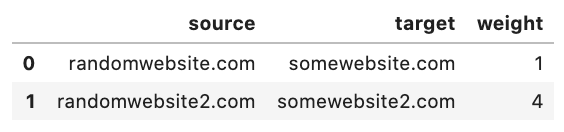
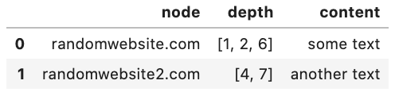

# WebCrawler
 
This is a tool to crawl links and grab contents recursively. The project was inspired from the emerging field of social network analysis in network science. WebCrawler is an initiative to tackle current unavailability of free highly customizable tool to fetch data for hyperlink analysis. The parts of this program can be used independently; if you are familiar with CLI, then running multiprocess_crawling() from terminal works the same as GUI. The latter was made to help potential users who aren't familiar with python. 

## Status
OK

## How to easily run this?
- Download the zip of the entire repo
- Make sure you have chrome browser in your computer and four chromedrivers to the version of your chrome browser, I have included them in the folder (if your chrome browser is ver. 83, you don't need to download them). Other versions available at:https://chromedriver.chromium.org/. You can download one and duplicate/copy-paste them 4 times and rename them chromedrivers1 .... chromedrivers4 and put it in the Hyperlink Analysis folder you downloaded from this repo
- Open terminal / command prompt and browse into the Hyperlink Analysis folder
- type: python MainWindow.py 
- A window for the app will appear, you can try few settings for webcrawling. Enjoy! 

## Overview

- "Load your seed file": press the button to browse your seed file
  - Seed file must be in csv format 
- "Crawling depth" : drop-down to select your desired crawling depth. Technically, the limit can be set to unlimited, but at this stage, the limit is set on 10
- "Filter type"
  - Non-domestic: when selected, the program will exclude all the domestic links from the crawl (domestic : toplevel domain name and suffix are the same between source and target; e.g. if google.com has an edge directed to mail.google.com, this edge will be excluded in that crawling instance and mail.google.com won't be registed to nodes list for that particular depth of crawling)
  - Keywords : If you have any desired query to be matched to the text content of your crawl, you can check the box and then the "select filter file" button will be enabled. Acceptable format for the query file is csv with quotation mark surrounding each instance of string. 
    - Sample query 1 (in your csv file): ('test' and 'bool') or 'boolean' 
    - Sample query 2 (in your csv file): 'what' and 'is' or 'this' 
    - Sample query 3 (in your csv file): 'might as well get a sentence' and 'is' or 'this' 
- Number of concurrent crawling : Technically, it can be set to 100, however for the purpose of this testing stage, limit is set to 4. The avaiability will depend on your machine.
- Edges filename : filename of your edges file
- Nodes filename : filename of your nodes file
   

When the aforementioned information boxes have been filled and the check-box for disclaimer has been selected, press the "run the crawl" button. You will see this window upon pressing the button:
 

 
Press "yes" to execute the crawl, or if you're unsure of the profile, press "back to previous window". There will be a number of chrome windows pop up (depending on your desired # of process) which will exit on their own when crawl is finished. If you need to kill the crawling process prematurely, press "stop everything" (button will be enabled after crawl is executed).

## Sample Output

#### Edges file format

 
Weight is defined as the number of edges between the two nodes.
 
 
 

#### Nodes file format
 
 
* Depth is defined as the recursive count from the seed node set to the node. If there are duplicates of integers in the list, it means that the node was found multiple times in that particular depth. The length of this list can be converted as the weight of that node (or the number of in-links of that node) as a whole or in each recursive step depending on your needs. 
 
 
 
* Both files will also contain errors found during crawl (if any) so that users can analyze the potential biases in their dataset
 
 
## Disclaimer
This is NOT the entirity of a kit needed for hyperlink analysis, rather a crawler to fetch an appropriate set of data for calculations of hyperlink analysis. Such kit for calculations of network centralities and measurements are available via NetworkX package in Python which accept the output resulted from my code. Also, I'm experimenting on using outlinks only and compensating it by enabling crawling for virtually unlimited number of steps (depending on time and # of CPU you have). There are similar tool availabe via web interface at issuecrawler.net or Voson Uberlink, however they're limited to at most 4 steps crawling (from the initial seed links).

## What's next 
- Upload finalized test cases
- Create a standalone for Mac and Windows
- Testing it on anti-vaccine online community
- Migrate from reading html to pytesseract for content extraction
